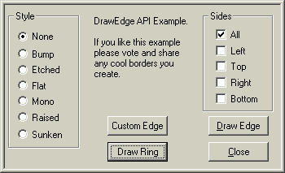



## DrawEdge Example

### Description

This example shows how to use the DrawEdge API. I wrote this because I've seen a lot of people using line controls to produce this effect. DrawEdge is faster and easier to use.
 
### More Info
 
Just select the Style and Sides you want to draw then click the "Draw Edge" button.

             |
---                |---
**Submitted On**   |2000-10-12 10:17:38
**By**             |[Glenn C\.](https://github.com/Planet-Source-Code/PSCIndex/blob/master/ByAuthor/glenn-c.md)
**Level**          |Intermediate
**User Rating**    |4.3 (26 globes from 6 users)
**Compatibility**  |VB 4\.0 \(32\-bit\), VB 5\.0, VB 6\.0
**Category**       |[Windows API Call/ Explanation](https://github.com/Planet-Source-Code/PSCIndex/blob/master/ByCategory/windows-api-call-explanation__1-39.md)
**World**          |[Visual Basic](https://github.com/Planet-Source-Code/PSCIndex/blob/master/ByWorld/visual-basic.md)
**Archive File**   |[CODE\_UPLOAD1061210122000\.zip](https://github.com/Planet-Source-Code/glenn-c-drawedge-example__1-12021/archive/master.zip)

